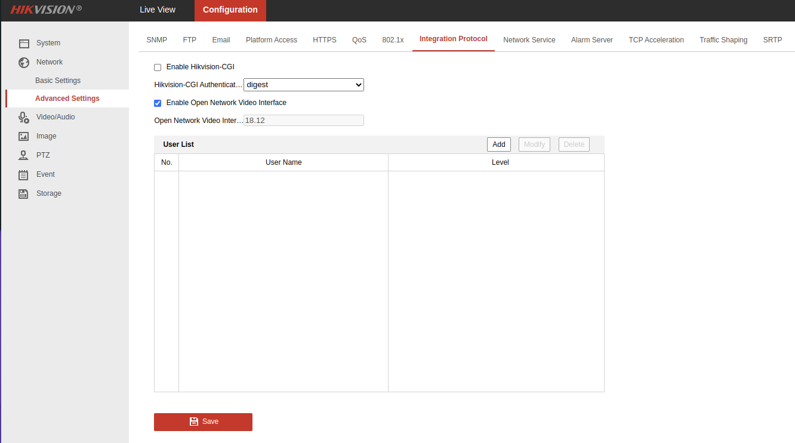

# Setup Hikvision DS-2DE2A404IW-DE3

- Plug in the power cord and ethernet cord to the camera if not already
- Install `avahi-utils` if not already installed
    ```shell
    sudo apt-get install avahi-utils
    ```
- Search your network for the camera(s)
    ```shell
    avahi-browse -t _CGI._tcp -r
    ```
- It should be found in the ip `192.168.1.64`

- Run this to find your computer's local ip address
    ```shell
    ip route get to 1.1.1.1 | sed -En 's/.* src ([.0-9]+).*/\1/p'
    ```


- If your computer is not already on the `192.168.1.0/24` subnet, change your computer's ip address to be static in the range of `192.168.1.1-192.168.1.254`
- Open `192.168.1.64` in browser
- Set a default admin password (note: this is for the control panel, and NOT the onvif user!)
- Enable onvif (see image)

  

- Click Add in the user list
- Set user/pass for onvif administrator user

  

- You may need to disable the login ban (see image)

  

- Enable dhcp (but before that, copy down the MAC address on this page for use later)

  

- Reboot device
- If you changed your computer's subnet up above, change back to your normal one
- Configure user/pass for the device-onvif-camera service

Search your network for the camera(s) again
```shell
avahi-browse -t _CGI._tcp -r
```